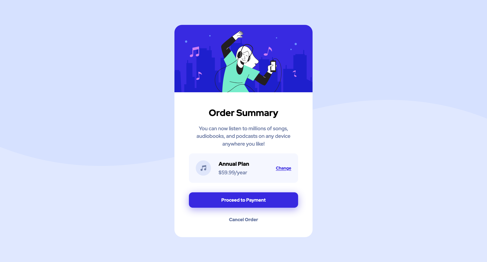

# Frontend Mentor - Order summary card solution

This is a solution to the [Order summary card challenge on Frontend Mentor](https://www.frontendmentor.io/challenges/order-summary-component-QlPmajDUj). Frontend Mentor challenges help you improve your coding skills by building realistic projects.

## Table of contents

- [Overview](#overview)
  - [The challenge](#the-challenge)
  - [Screenshot](#screenshot)
  - [Links](#links)
- [My process](#my-process)
  - [Built with](#built-with)
  - [What I learned](#what-i-learned)
  - [Continued development](#continued-development)
  - [Useful resources](#useful-resources)
- [Author](#author)
- [Acknowledgments](#acknowledgments)

**Note: Delete this note and update the table of contents based on what sections you keep.**

## Overview

### The challenge

Users should be able to:

- See hover states for interactive elements

### Screenshot



### Links

- Solution URL: [Add solution URL here](https://your-solution-url.com)
- Live Site URL: [Add live site URL here](https://order-summary-componant-jack-morre.netlify.app/)

## My process

### Built with

- Semantic HTML5 markup
- CSS custom properties
- Flexbox
- Desktop-first workflow

### What I learned

Messing around with images

I picked this challenge because of the image that it had to incorporate withing the design. I don't have a lot of knowledge on the best practises for dealing with images in CSS and HTML so I wanted to test my skill with this little challenge.

I went through multiple different ideas of how to best center and size the image to make sure that it looked the same as the reference images.

I found out pretty early that background size was not going to work because the size was going to be a little bigger than I needed it to be if i set it as cover.

I thought this was bad practise but because I knew the exact with of the container, setting the width to exactly cover the full width was the easier method for me.

```css
.container {
	width: 363px;
}

.main-img {
	width: 363px;
}
```

This made sure that the image would cover the full width of the container and then using overflow:hidden; allowed me to make sure that the edges were rounded to the container.

Flexbox is fun

Flexbox is a humans best friend when it comes to centuring anything in web design.

A lot of the containers in the project have been centered with flexbox as it seems like the easiest method to be able to center pretty much anything.

I used it to center the image as i didn't really know of any other way to be able to do it. It worked perfectly and actually better than intend. - if there is a better solution for this please do let me know.

### Continued development

I still feel like I need to push my sel with images a lot more.

Understanding UI/UX design methods in these challenges to get me to be more create when come up with my own ideas.

I have felt that i need to know a lot more about pseudo classes as there are a lot out there and I only know a few basic ones.

Use this section to outline areas that you want to continue focusing on in future projects. These could be concepts you're still not completely comfortable with or techniques you found useful that you want to refine and perfect.

### Useful resources

- [resource 1](https://blog.hubspot.com/website/center-an-image-in-html#:~:text=Step%201%3A%20Wrap%20the%20image,to%20a%20fixed%20length%20value.) - Gave me multiple way to center an image with in a container, I used Mthod 3 for this challenge and will most likely use this in the future.

## Author

- Website - I don't have a website... yet.
- Frontend Mentor - [@yourusername](https://www.frontendmentor.io/profile/yourusername)
- Twitter - [@yourusername](https://www.twitter.com/dollywob)
